 ____

## 前言

  曾几何时，我也曾对一加9Pro有一种特别的感觉，类似于米11u那样为之着迷，但苦于囊中羞涩，并不能很好的体验一番，也只能在oppo的展台前玩弄个几分钟，如今，9Pro的二手价格已经到了900以内，急不可耐必须买下好好体验一番Ｏ(≧▽≦)Ｏ

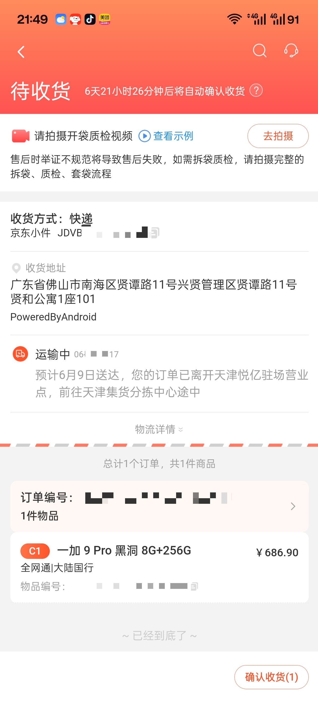

###### 某2b平台甚至掉到了600+

____

## 外观

  初拿到一加9Pro，这质感真的可以说无可比拟了😋，在我摸过的所有手机中它的质感可以排到t0了 即使我买的是黑色，也丝毫不影响它应有的美感(๑´∀`๑)，ag磨砂玻璃不沾指纹，还多了几分美感[托腮]，相机镜头也没有特别突兀，哈苏标更是相得益彰（起码比10Pro和11的处理好太多了，尤其是11的马桶盖直接薄纱( ￣▽￣)σ）换做谁估计都不会对这外观有多大意见

###### （她真好看.jpg)

____

## 相机

 主摄imx789+广角766+长焦ov08a10的组合，放在当年亦或是如今其实都大差不差（因为自家老大哥x8如今又用回766类似物当主摄了-_-#）唯一的缺点可能就是长焦是直立了（好像也不算缺点？），还有老哈苏色调会比o自家的色调好太多🤔（相比较于x2Pro）这里放几张图片，大家感受一下～

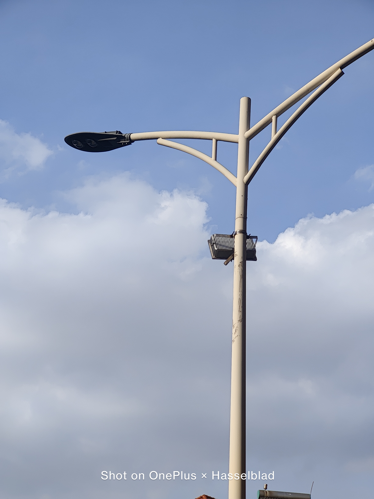

|>长焦（ov08a10）

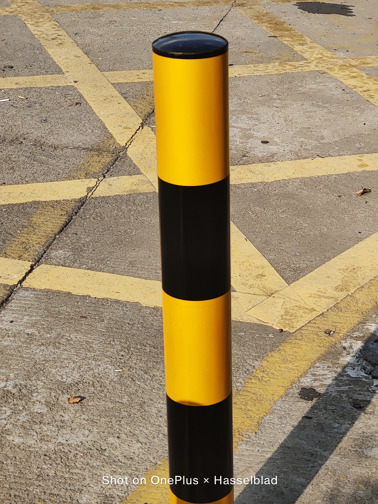

|>主摄裁切（imx789）(2.1x)

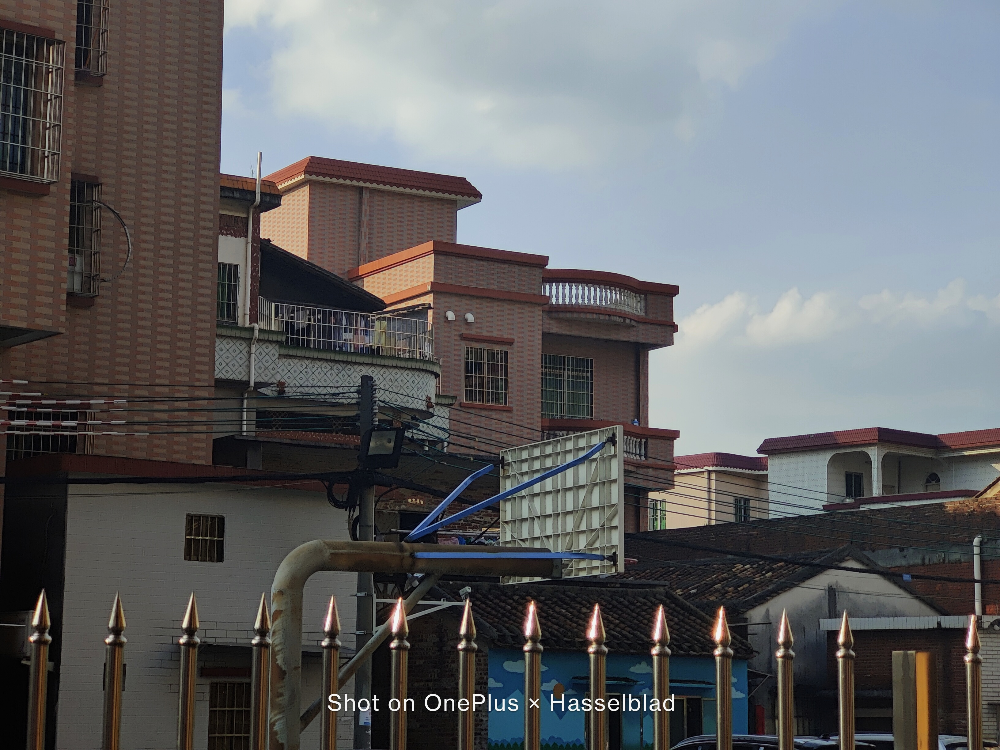

|>主摄（imx789）

____

## 系统&游戏体验

  刚买回来的时候就已经是c14了，多少还是有些阉割的，不过出乎我的意料，c14对888的温控十分严格（或许是因为我只用过11u的缘故？）一般情况也确实和8e日用体验差不多，不过小bug还是时常会有QAQ

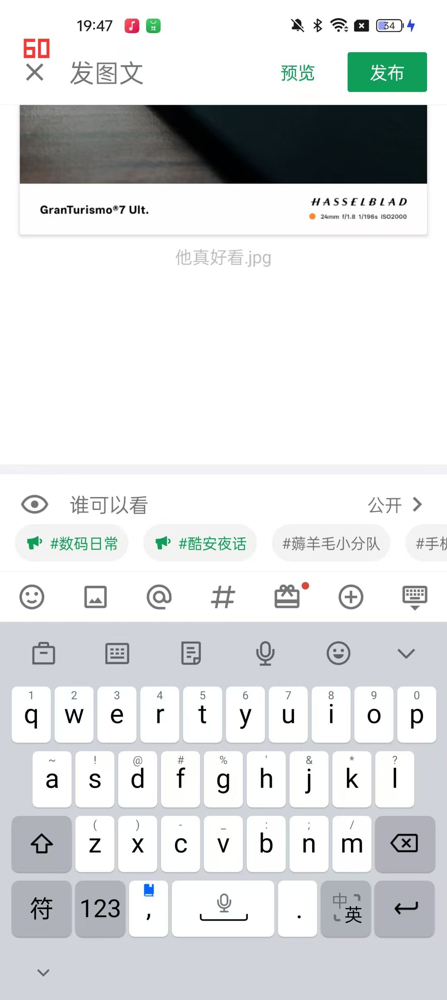

###### 键盘莫名锁60

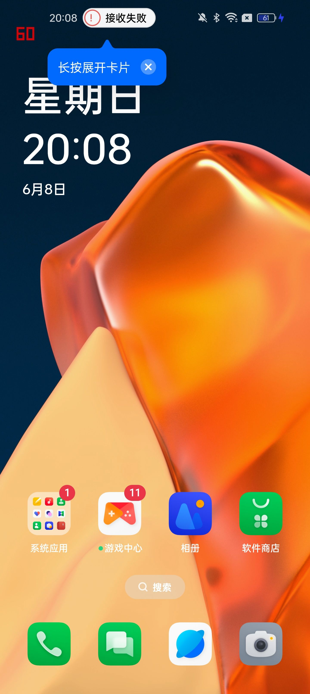

###### 充电时莫名锁60

其他体验就真的和其他的c14拉不开什么差距了[笑眼]关于c14，我想就不必多言了，ota之神的名号确实不是盖的qwq

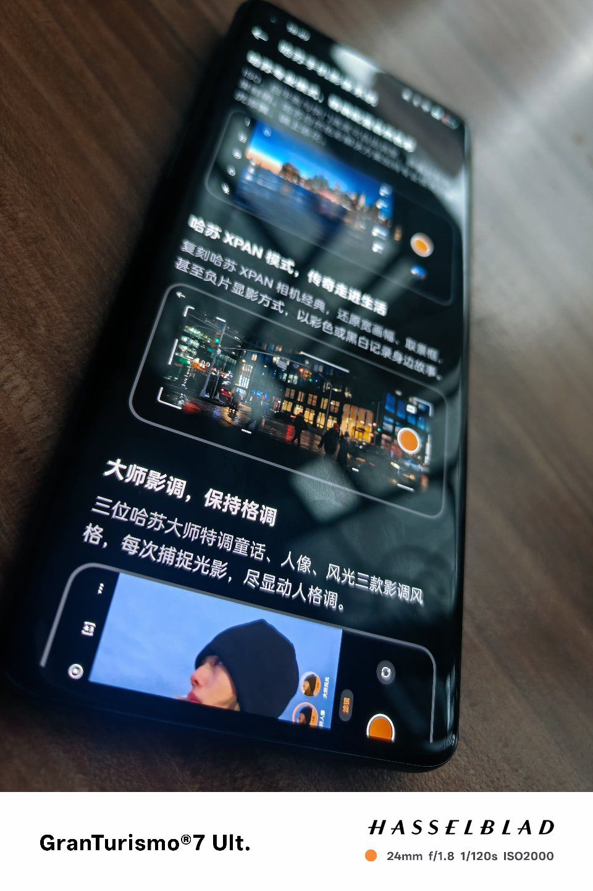

###### 个人认为最好看的一代哈苏

  因为是888，再加上我曾经在11u上留下的阴影，我实在没勇气去挑战“大型游戏”（指内存大），不过p5x还是可以试试的[阴险]，尝试在片山宫殿，也就是神秘供电站跑图10min，画面选项如下

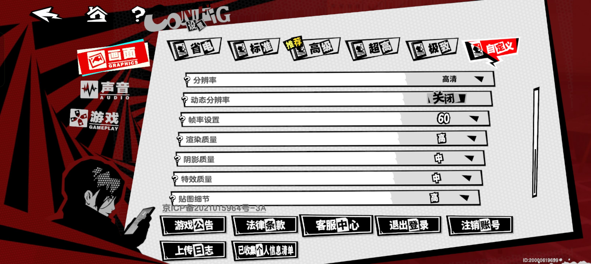

不过这成绩，，，

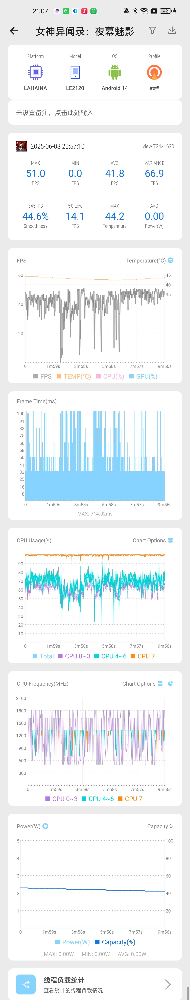

如果日常体验我能给到8分的话，那游戏真的只能给到4分了[捂脸]但毕竟已经是3 4年前的🐔还是888，还是别玩游戏了吧（

____

## 屏幕

 作为一台21年的🐔，能有2k120hz+ltpo甚至是e4瓶属于是超神的存在，换用卢总的话就是“桶挡无敌[笑眼]”（不过后面连年10p和11都用e4是认真的？）现在也能和自家x8p掰掰手腕，可见e4神力😎

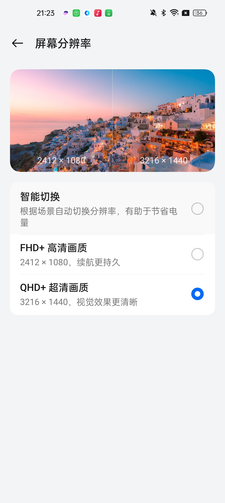

###### （一加15：孩子们我的2k屏呢😭😭😭）

___

## 其他硬件

 4500mah的电池其实说大不大说小不小，但放入基本就和隔壁小瓶手机一桌了😩，不过66w快充的确还是能有一战之力的qwq，另外这颗马达简直是让我怀疑是不是坏了，即使拉到最大，震感依旧稀疏，更搞的是还查不到型号，都能和gt7p打的有来有回，所以我有理由怀疑这就是0809🤔，其他的硬件就没有什么好说的了，可能似乎大概也许就是那个时候期间的水准了吧🤓

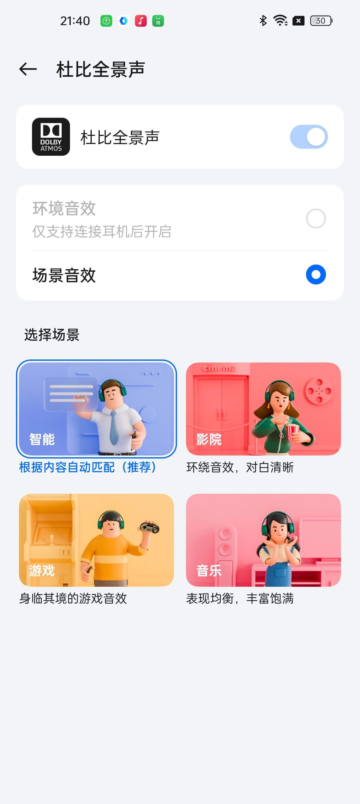

###### 牢大最喜欢的杜比🤓（一加13：孩子们我的杜比呢😡😡😡）

____

## 总结

  一加9Pro无论在当年还是现在，都有一些可圈可点的地方在里头，有些硬件甚至可以薄纱自家现在的老大哥（x8:在想我的事？🤓）也难怪自身有那么多的拥护者，虽然光辉盖不过大哥7p系列，但业已是机中之王啦~

____

转自酷安图文
