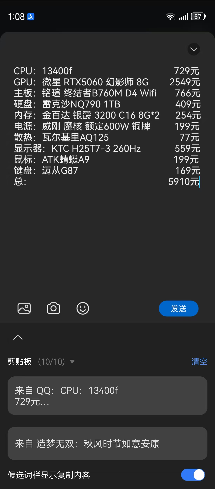
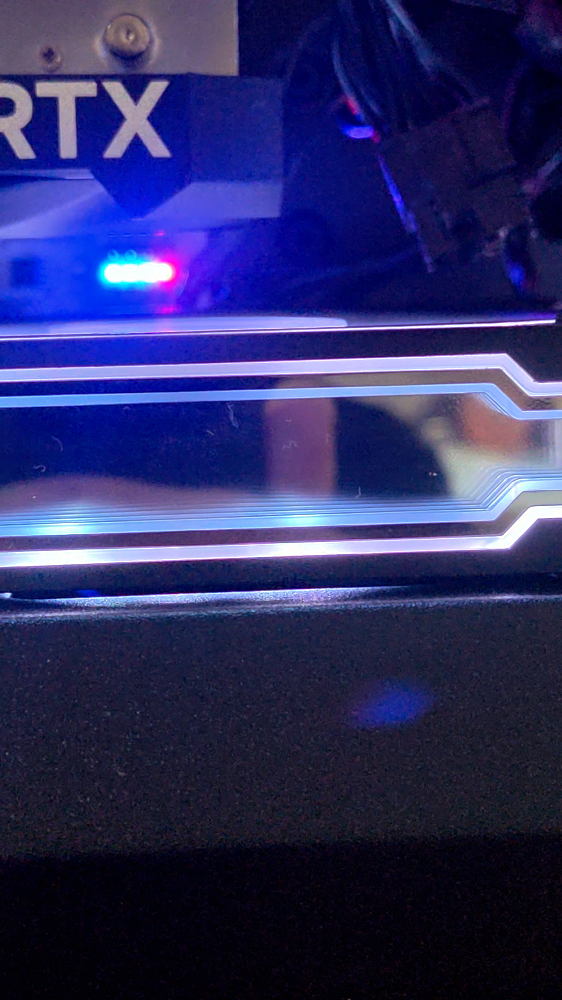
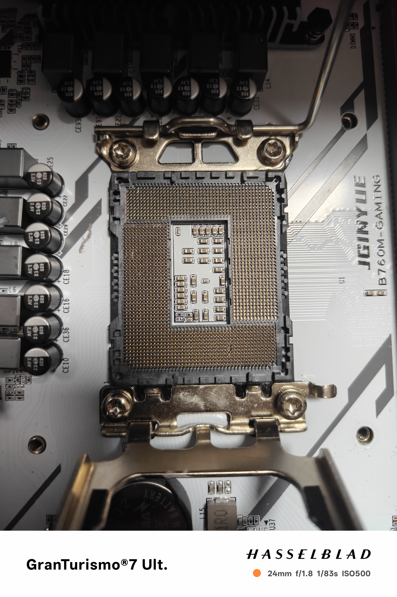
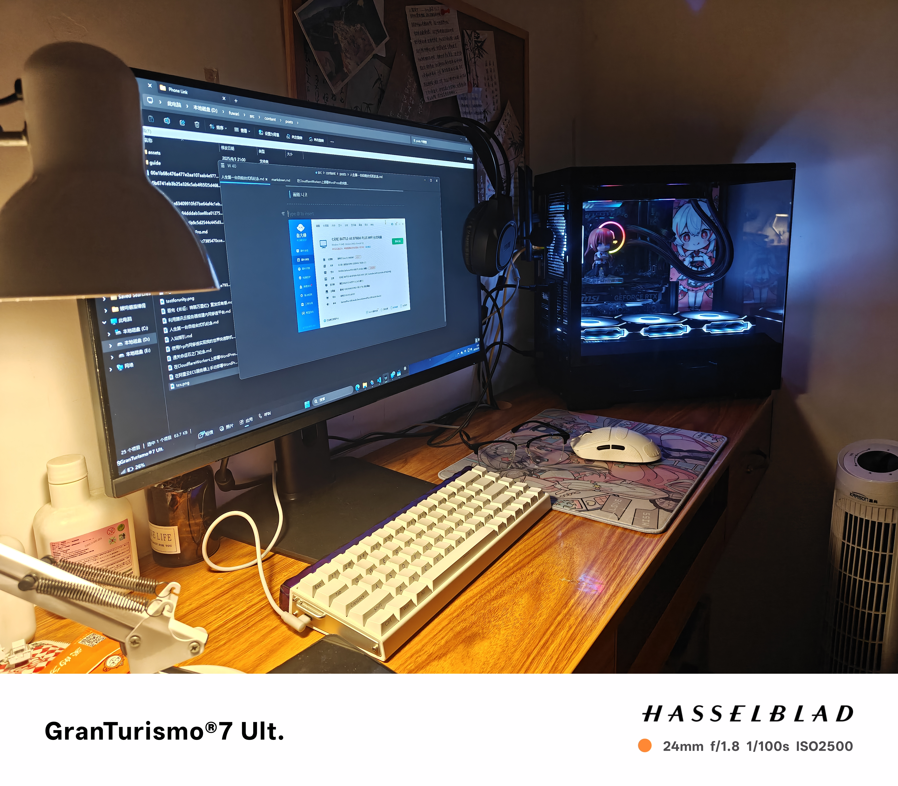
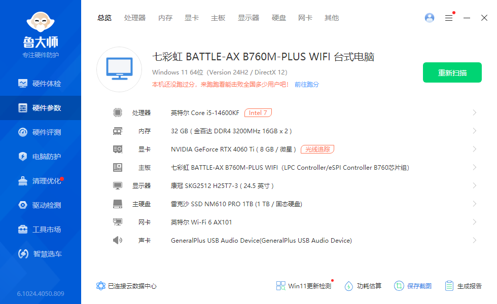

> 画师:니코

---

## 前言

  此前手上能用来玩端游的只有个鸡哥的极光x，i7-14650HX配4070laptop的版本，配置也还说的过去，不过实在没有台式机那么舒服，前段时间考完中考父母给了我1w，就撮合着想整台台式机来用，正好满足日常所需

____

## 经过

对于配置而言我觉得也用不着太好，毕竟4070laptop的性能也的确于我而言都超出日常所需一大截了，我只想撺台5-6k价位，码码字偶尔玩玩游戏的机子就行了，其余就在外观上下下功夫就得了，但bro对手机可能算得上是了如指掌，但对于电脑这块数据库还停留在21年30系问世的时候，找了几家专门撺电脑整机的商家看都不咋满意，我的朋友正巧也在想着撺套同价位左右的机子，我就要来看了看

  又经高人指点换了块4060ti万图师 8g（我™服了神人朋友早知道买5060的亏炸了气死我了！！！）不过省下来一点钱要是换精粤的板就刚好够上14660kf了，也就买了散片用上了。。。稍微学习了一下改了改配置就买好等待到货了

  到货装机，稍微有点困难，线完全不会理，本人手残党哭晕在厕所里。。。上机点亮，没想到bro的扫把星被动立马触发，主板一直过不了自检，boot自检灯一直是亮的

  此时我最怕的就是一点——主板三大件不会坏了吧，就这样过了一整天（没错是一整天！！！）才发现是之前不小心装cpu反了把针脚弄凹进去了，但是bro手残又发作了，就在挑针脚的时候手一抖，不知到啥时候就弄断一根针脚，更可气的是这个针脚就是让cpu与ram通信的那根，悬着的心终于死了，无奈大出血换了块七彩虹的b760m plus v20 d4 wifi（这名字好绕口。。）

  屏幕我选了最近比较有性价比的H25T7-3，1k260hz，性价比高的同时完美符合我的要求，秒拿下了，至于其他的就跟风买了（bro也跟风买了磁轴键盘😭😭😭），不知道花了多久之后，总算是装的七七八八了

---

## 详细配置&总结

 总的配置如下

  还有一点就是为毛我主板选的七彩虹而非大火的铭瑄终结者，是因为colorful人如其名，对argb调教的挺好，比同价位铭瑄的终结者b760m多俩相供电的同时还更能光污染，bro挺喜欢的🤓，总之弄完这一堆铁坨时间也到了8月30，又要上学了😭😭😭

---

以上
