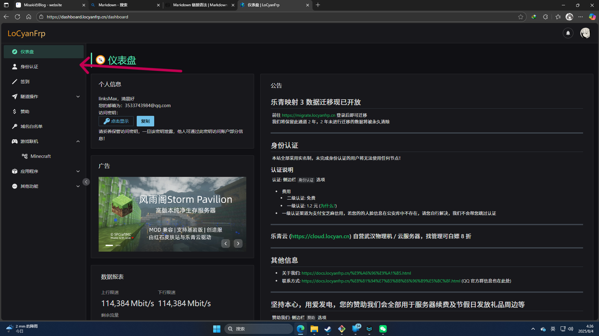

# 前言

  Frp内网穿透 是一项通过映射本地IP从而实现在公网直接访问内网IP的一种方式 本文将会以LoCyanFrp乐青映射为例 通过内网穿透的方式实现我的世界（Minecraft）远程联机

____

# 准备工作

1. Minecraft（java版与基岩版均可）

2. LoCyanFrp账号 （[点此进入LoCyanFrp官网注册](https://dashboard.locyanfrp.cn/ ))

3. 一张身份证与1.2元（CNY）
   
   首先进入LoCyanFrp官网 点击“身份认证”一栏 完成一、二级认证 具体位置如图

  我们需要将自己的身份证号按网站指导依次填入 同时在一级认证认证时需缴纳1.2元用于人脸识别相关费用 成功界面如图所示

此时你就可以使用国内和国外的全部节点了 而现在，我们就完成了全部的准备工作

____

# 建立隧道

  单击“隧道操作”一栏 点击”添加隧道“  具体位置如图

 选择一个适合你的隧道 建议使用国内节点(根据本人使用情况来看使用国外节点在连接时可能需要vpn等工具 故不推荐 )，隧道名可任意填写 java版玩家选择TCP 内网端口填25565(java版默认端口)， 基岩版玩家选择UDP 内网端口填写19132（基岩版默认端口)远程端口随机即可，这里以java版为例

  单击创建，此时你已完成创建隧道

____

# 下载Nya LoCyanFrp!乐青映射客户端

  单击主页“其他功能”——“软件下载”一栏，点击“Nya LoCyanFrp! 乐青映射启动器”栏目下的下载地址（三个均可），推荐食用第二个，具体位置如图

  进入页面，选择适合你平台的客户端版本，这里以windows端为例，建议下载[nyalcf-1.0.4+1-windows-setup.exe](https://mirrors.locyan.cn/github-release/Muska-Ami/NyaLCF/LatestRelease/nyalcf-1.0.4%2B1-windows-setup.exe )该版本（点击蓝链可直接下载）具体位置如图

  下载完毕后 直接无脑下一步直至以下界面出现，自此，我们就完成了内网穿透的所有必要操作

____

# 启动Minecraft内置的局域网联机功能

  打开启动器（官方启动器、PCL、HMCL、BakaXL均可）或者minecraft的UWP（基岩版）进入世界后按键盘上的ESC键进入设置界面，单击“对局域网开放”一栏，在端口一侧填写25565或19132，其他选项可按自己喜好来填。如果你希望可以让朋友和自己在离线登录的情况下也能一起畅玩minecraft的话（java版）你可以在添加“自定义局域网联机”这个模组，本教程不包括安装该模组，具体教程可上[这个视频](https://www.bilibili.com/video/BV1dj421Z7ki/)来安装该模组 在“对其它玩家的设置”下方选项一栏更改为“离线模式+UUID修复”，具体操作界面如图所示

单击“创建局域网世界”，此时你就完成了本段的所有操作

____

# 启用隧道

  打开Nya LoCyanFrp!乐青启动映射器 单击左上角的三横进入菜单，点击进入“隧道列表”界面，启动你的隧道，再次单击左上角的菜单，进入控制台界面具体界面如下

如果你也出现了该界面中的“您可以使用 [xxxxxxx] 连接至您的隧道: xxxxxxx”则代表你的隧道被成功启动了

____

# 开始联机

  回到LoCyanFrp网站的“隧道列表”界面，复制你隧道的连接地址，发送给你的朋友，让你的朋友打开与你版本相匹配的客户端，点击主页的“多人游戏”——“添加服务器”一栏 将复制的链接粘贴上去，单击”完成“，此时回到多人游戏界面，你的朋友应该可以看到这样的界面

  点击出现的Minecraft启动器，在等待一段时间后，你的朋友就可以和你一同联机了

____
